# 📊 Final Sales & Customer Intelligence Dashboard

## 🚀 Project Overview

This project is a comprehensive Power BI dashboard developed to analyze **Sales Performance, Customer Behavior, Product Performance, Regional Performance, and Returns Analysis**.

The dashboard was built using **Star Schema data modeling**, **DAX calculations**, **Time Intelligence functions**, **Drillthrough functionality**, **Mobile Layout optimization**, and **Row-Level Security (RLS)**.

This project was developed as a Final Power BI Project.

---

# 📂 Repository Structure

```text
Final_Sales_Customer_Intelligence_Dashboard/

│
├── README.md
├── Final_Sales_Customer_Performance_Dashboard.pbix
│
└── Screenshots/
    ├── 01_Data_Model.png
    ├── 02_Executive_Overview.png
    ├── 03_Customer_Analysis.png
    ├── 04_Product_Analysis.png
    ├── 05_Regional_Analysis.png
    ├── 06_Customer_Drillthrough.png
    ├── 07_Mobile_Layout1.png
    ├── 07_Mobile_Layout2.png
    ├── 07_Mobile_Layout3.png
    ├── 08_RLS_Setup.png
    ├── 09_View_As_Role.png
    └── 10_Page_Navigator.png
```

---

# 🎯 Project Objectives

* Build a Star Schema data model.
* Create DAX measures and KPIs.
* Implement Time Intelligence calculations.
* Develop an interactive multi-page dashboard.
* Implement Drillthrough functionality.
* Optimize dashboard for mobile devices.
* Apply Row-Level Security (RLS).
* Improve user experience with navigation features.

---

# 🗂 Dataset Tables

## Dimension Tables

* Customer_Dim
* Product_Dim
* Date_Dim
* Region_Dim

## Fact Tables

* Sales_Fact
* Returns_Fact

---

# 🔗 Data Model Relationships

| From Table   | Column     | To Table     | Column     |
| ------------ | ---------- | ------------ | ---------- |
| Sales_Fact   | CustomerID | Customer_Dim | CustomerID |
| Sales_Fact   | ProductID  | Product_Dim  | ProductID  |
| Sales_Fact   | DateID     | Date_Dim     | DateID     |
| Returns_Fact | SaleID     | Sales_Fact   | SaleID     |
| Customer_Dim | Region     | Region_Dim   | RegionName |

---

# 📊 DAX Measures Created

## KPI Measures

* Total Sales
* Total Orders
* Total Units Sold
* Average Order Value
* Estimated Profit
* Returned Orders
* Return Rate %

## Time Intelligence Measures

* Sales YTD
* Sales PY
* YOY %
* MOM %

## Calculated Columns

* Customer Full Name
* Profit Category
* Year Month

---

# 📄 Dashboard Pages

## 1️⃣ Executive Overview

Features:

* KPI Cards
* Sales Trend Analysis
* Regional Sales Performance
* Sales by Category
* Top 10 Products by Sales
* Interactive Slicers

📷

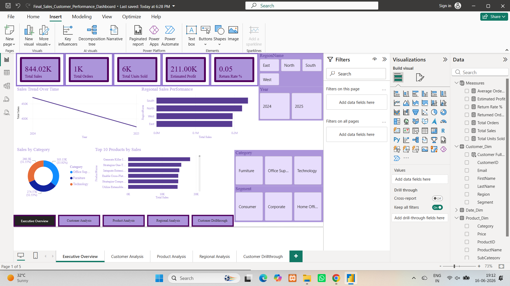

---

## 2️⃣ Customer Analysis

Features:

* Customer Performance Matrix
* Sales by Segment
* Top 10 Customers
* Customer Distribution by Region

📷

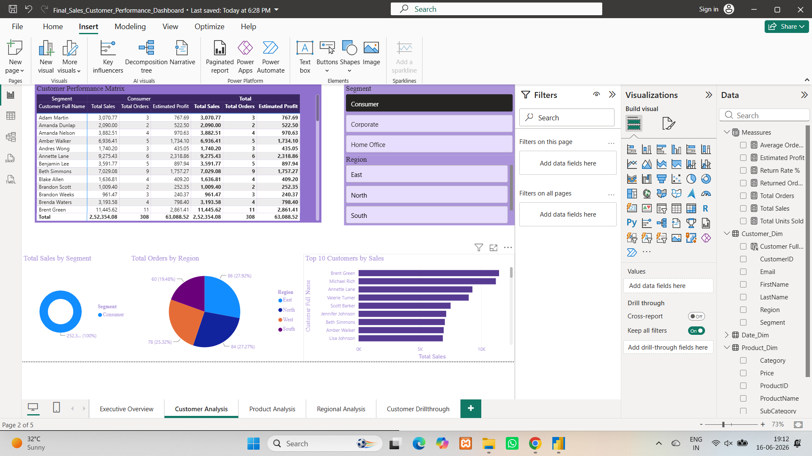

---

## 3️⃣ Product Analysis

Features:

* Category Performance
* SubCategory Analysis
* Top Products
* Product Performance Matrix

📷

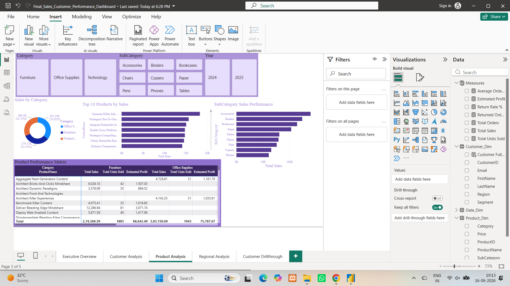

---

## 4️⃣ Regional Analysis

Features:

* Regional Sales Performance
* Returns by Region
* Regional Trends
* Regional Performance Matrix

📷

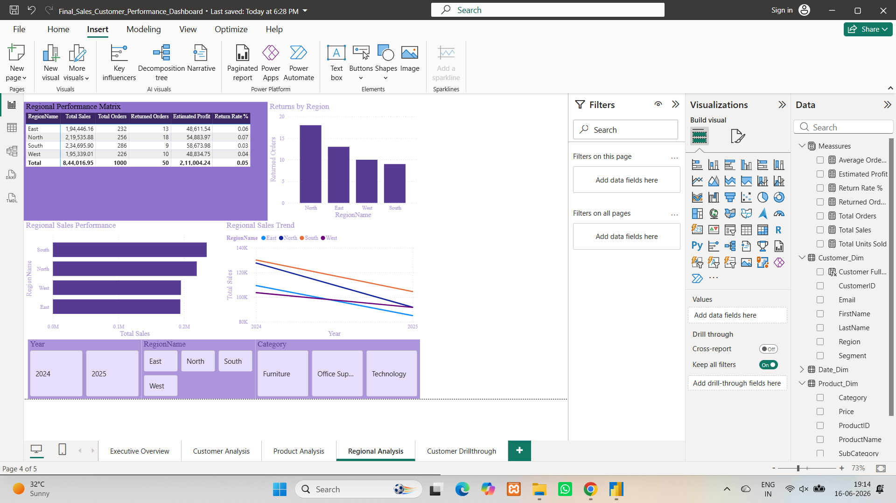

---

## 5️⃣ Customer Drillthrough

Features:

* Customer-specific analysis
* Purchased products summary
* Back navigation

📷

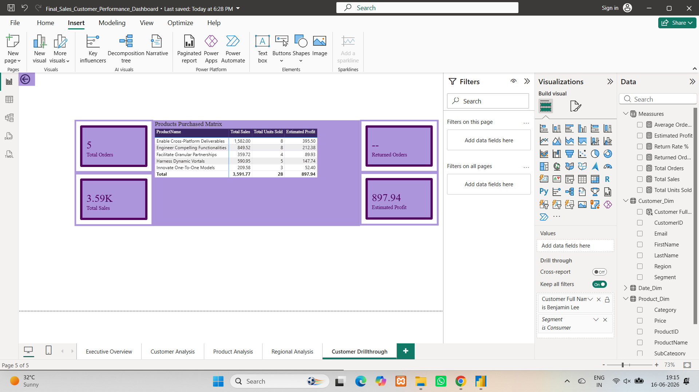

---

# 📱 Mobile Layout

Mobile-optimized dashboard views.

### Mobile Layout 1

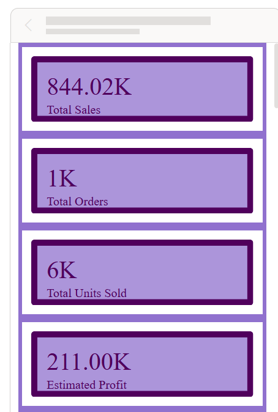

### Mobile Layout 2

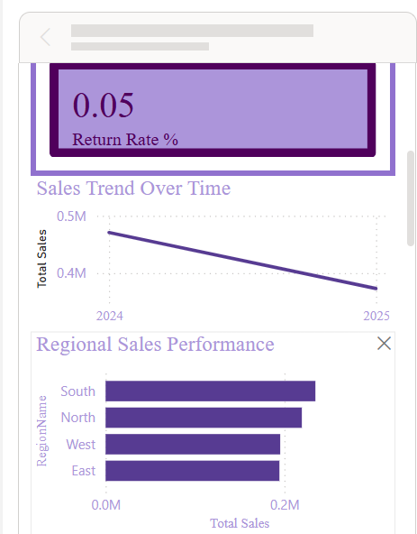

### Mobile Layout 3

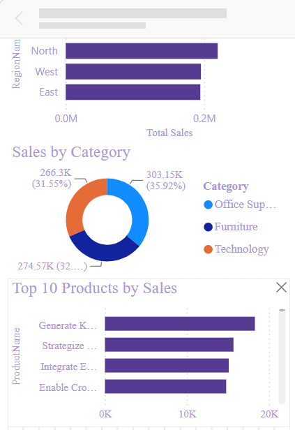

---

# 🔒 Row-Level Security (RLS)

Roles created:

* North Manager
* South Manager
* East Manager
* West Manager

Each role restricts data access to its assigned region.

## RLS Setup

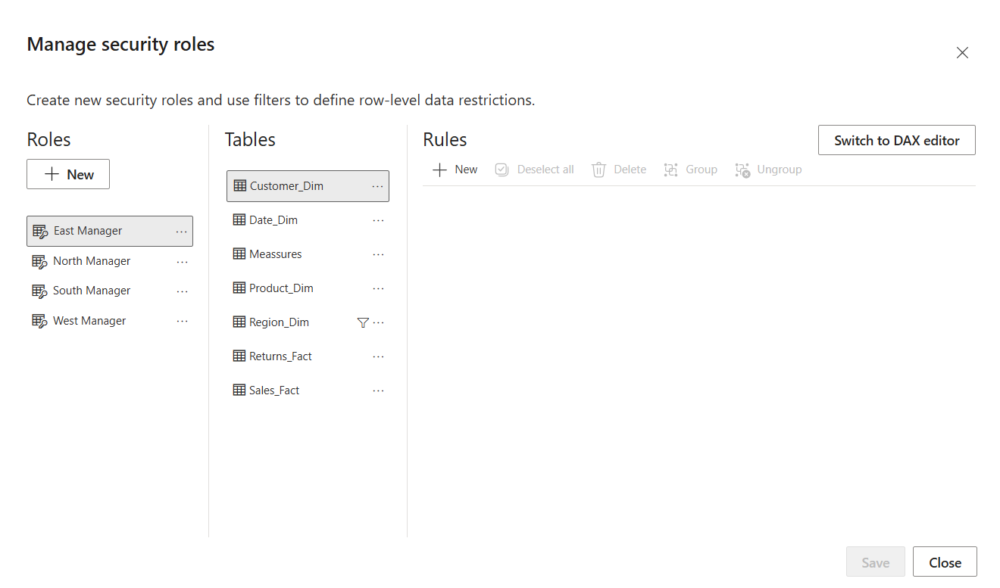

## View As Role

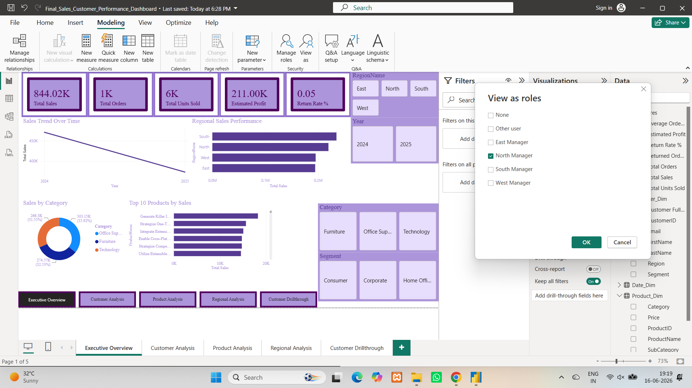

---

# 🧭 Navigation & User Experience

Features implemented:

* Interactive Slicers
* Drillthrough Navigation
* Back Button
* Page Navigator
* Mobile Layout Optimization

## Navigation

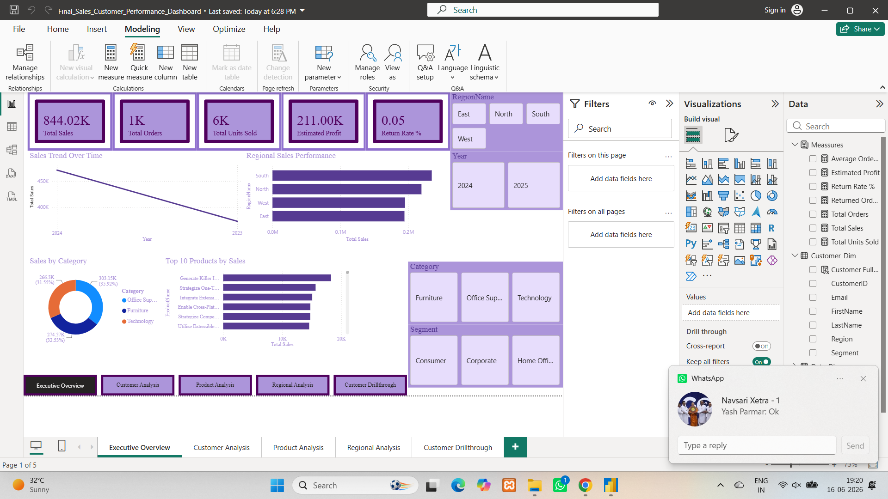

---

# 🛠 Technologies Used

* Microsoft Power BI Desktop
* Power Query
* DAX (Data Analysis Expressions)
* Data Modeling
* Row-Level Security (RLS)

---

# 📦 Deliverables

* Power BI Dashboard (.pbix)
* Dashboard Screenshots
* Mobile Layout Screenshots
* README.md Documentation

---

# 👨‍💻 Author

**Nilay**

**Final Sales & Customer Intelligence Dashboard**
